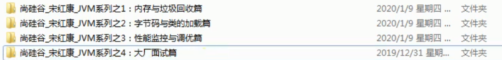

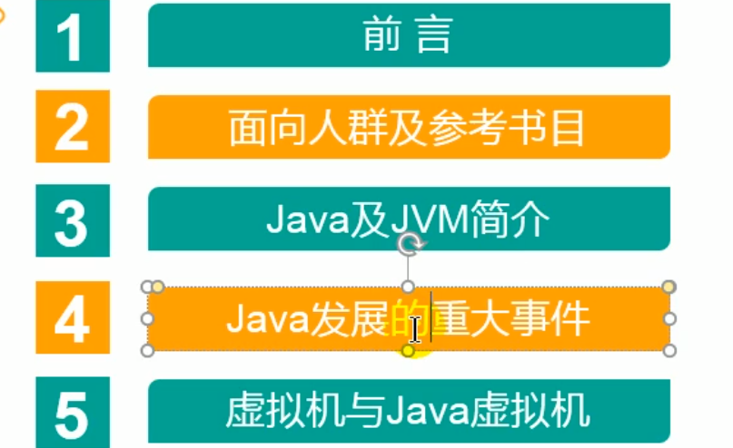

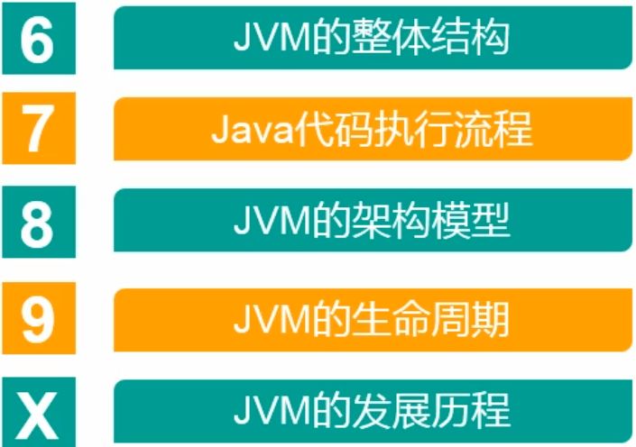

科班出身,C语言,汇编

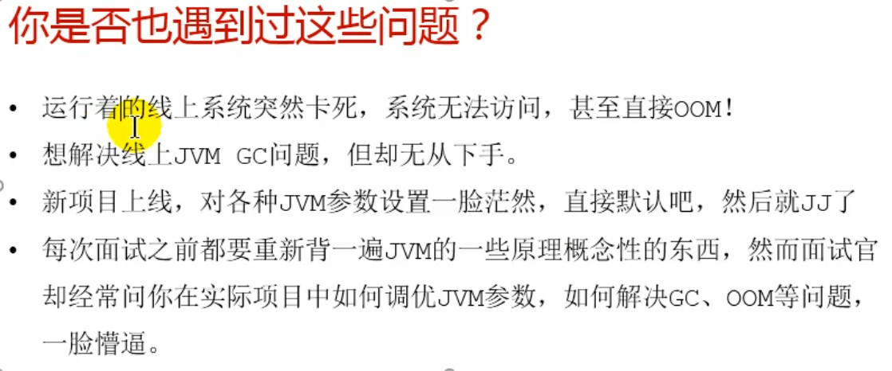

OOM : 内存溢出

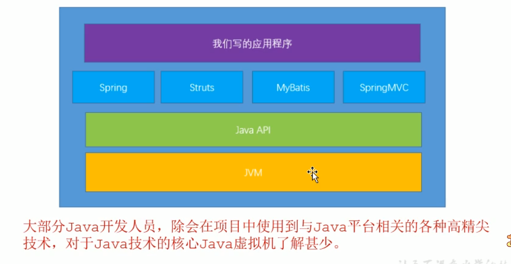

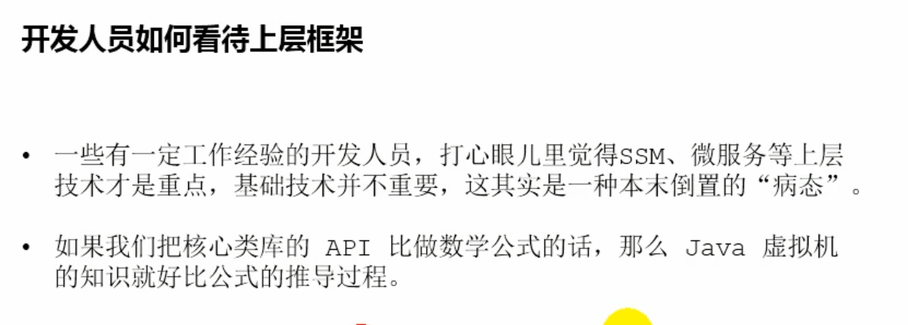

卷积神经网络

计算机组成原理

数据结构

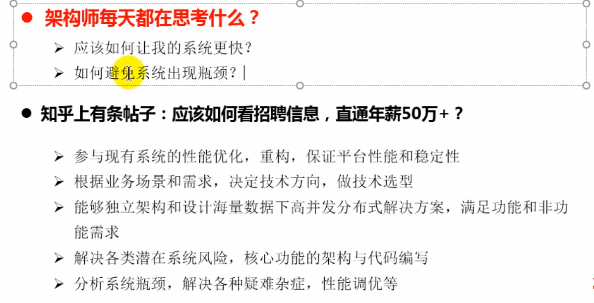

# 为什么要学习JVM

- 面试的需要(BATJ,TMD,PKQ等面试都要问)
- 中高级程序员必备技能
  - 项目管理, 调优的需要
- 追求极客的精神
  - 比如: 垃圾回收算法,JIT,底层原理

# Java vs C++
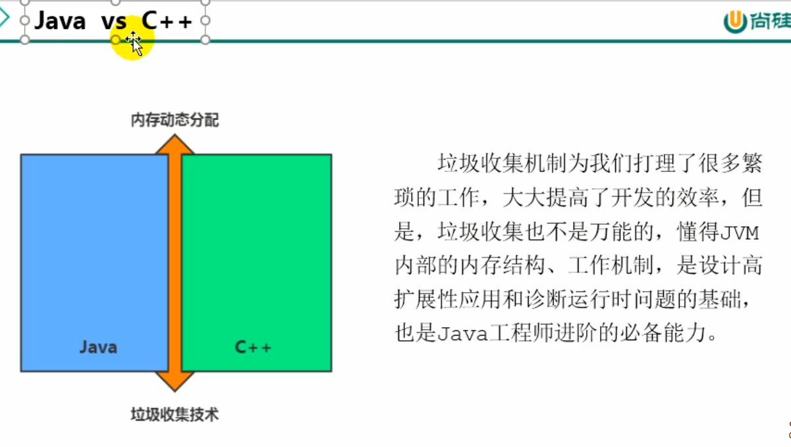

自己来管理内存的时候,你可以管理的很好

要是你的水平不是很高,那就白扯

# 面向的人群
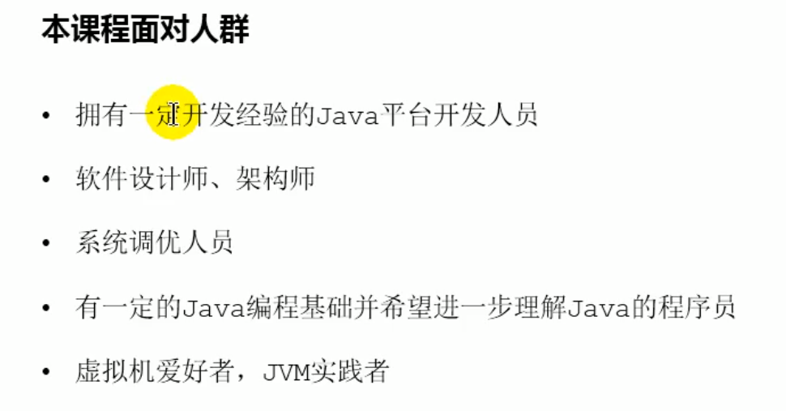

# 课程怎么讲

- 理论> 代码

- 通俗,移动,说人话

- 图解

# 参考书目

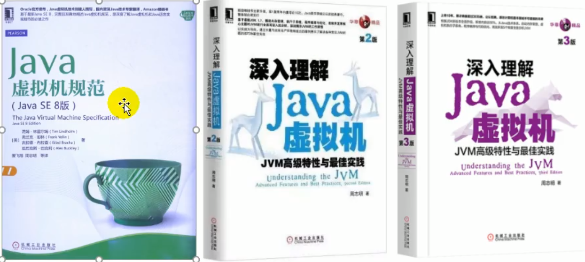

推荐后面2本书之一

# Tiobe
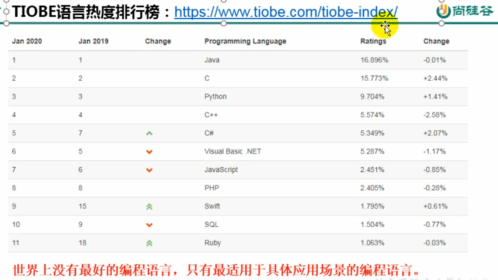

世界上没有最好的编程语言,只有最适合于具体应用场景的编程语言

# Java 生态圈
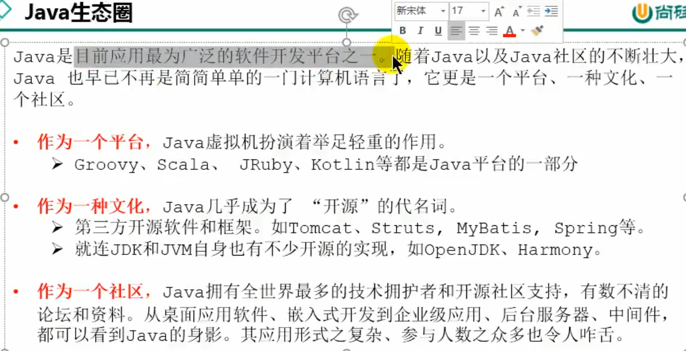

