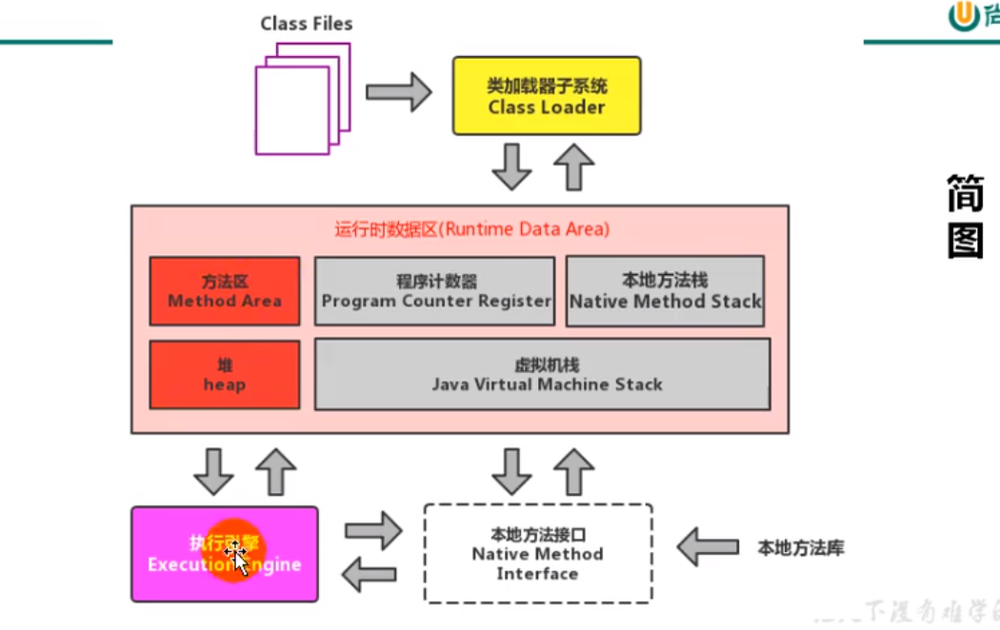

# JVM 架构


类加载器

咱们平时所说的栈就是虚拟机栈

### 中文的图
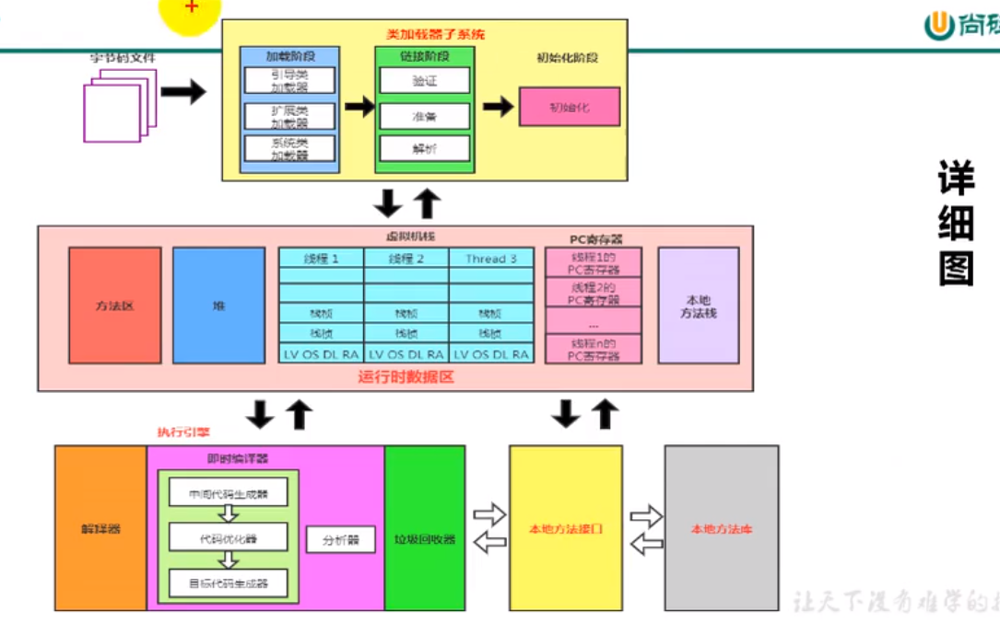

# 当前在第二章

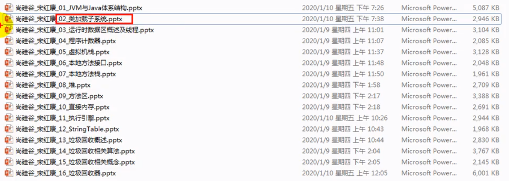

# 类加载器子系统作用


- 类加载器子系统负责从文件系统或者网络中加载class文件,class文件在文件开头有特定的文件标识.
- classloader只负责class文件的加载,至于它是否可以运行,则由ExecutionEngine决定
- 加载的类信息存放于一块称之为方法区的内存空间.除了类的信息外,方法区中还会存放运行时常量池信息,可能还包括字符串字面量和数字常量(这部分常量信息是Class文件中常量池部分的内存映射)
# ClassLoader 角色
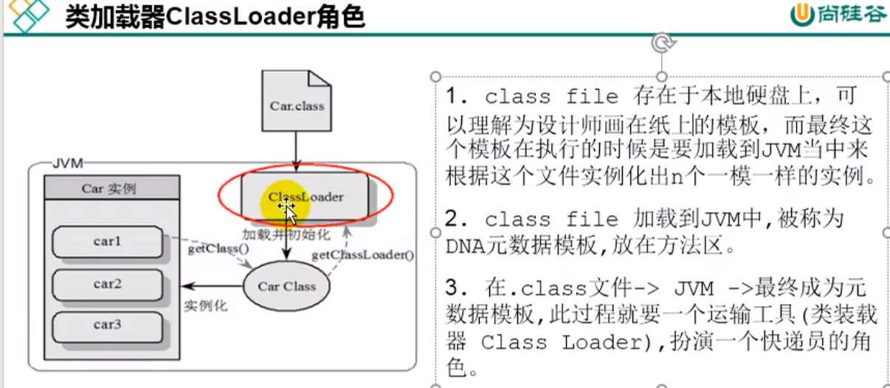
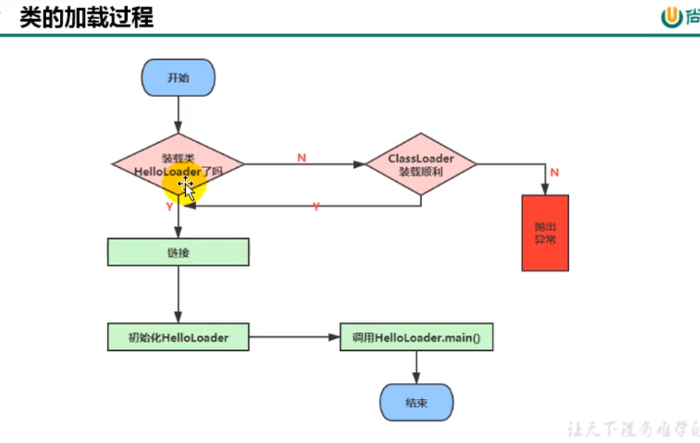

```java
package com.atguigu.java;

/**
 * ClassName: HelloLoader <br/>
 * Description: HelloLoader <br/>
 * Date: 2020-10-22 14:38 <br/>
 * <br/>
 *
 * @author yufengming
 * @version 产品版本信息 2020年10月22日14:38分 yufengming(victorfm@163.com) 新建<br/>
 * <p>
 * 修改记录
 * @email victorfm@163.com
 * @project study_note_01
 * @package com.atguigu.java
 */
public class HelloLoader {
    public static void main(String[] args) {
        System.out.println("谢谢Classloder加载~我");
        System.out.println("你的大恩大德, 我下辈子在报!");
    }
}

```


```java
//
// Source code recreated from a .class file by IntelliJ IDEA
// (powered by FernFlower decompiler)
//

package com.atguigu.java;

public class HelloLoader {
    public HelloLoader() {
    }

    public static void main(String[] args) {
        System.out.println("谢谢Classloder加载~我");
        System.out.println("你的大恩大德, 我下辈子在报!");
    }
}
```
# 类的加载过程

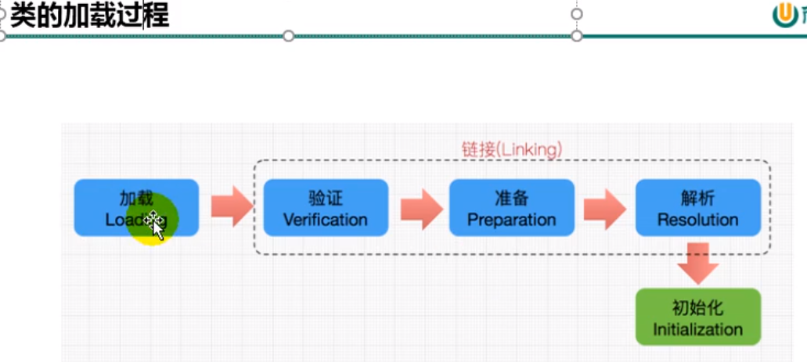


###  补充: 加载`.class`文件的方式- 从本地系统中直接加载
- 通过网络获取,典型场景: Web Applet
- 从zip压缩包中读取,成为日后jar,war格式的基础
- 运行时计算生成,使用最多的是:动态代理技术
- 由其他文件生成,典型场景:JSP应用
- 从专有数据库中提取`.class`文件,比较少见
- 从加密文件中获取,典型的防Class文件被反编译的保护措施

### 链接
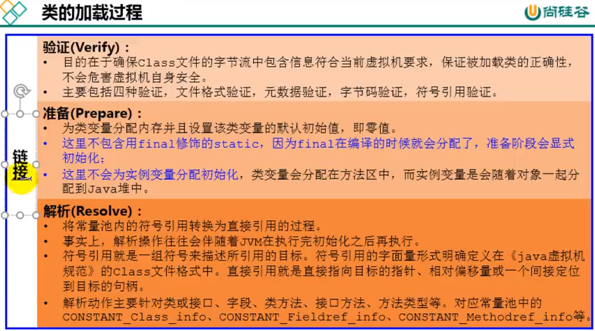

### init


CA FE BA BE  这个字节码开头的文件才是java虚拟机可识别的字节码文件

任何一个类,在声明之后都存在一个构造器


# 类的加载器的分类

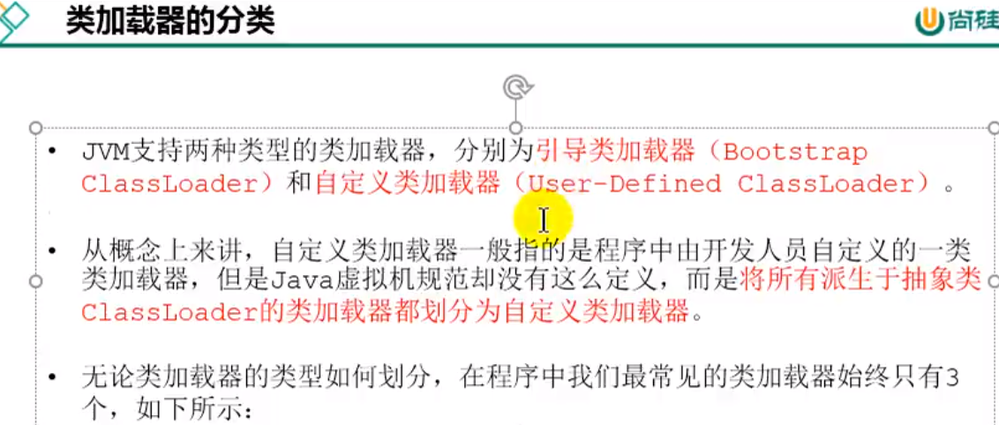


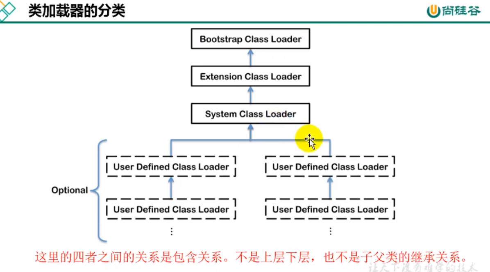

### 虚拟机自带的加载器

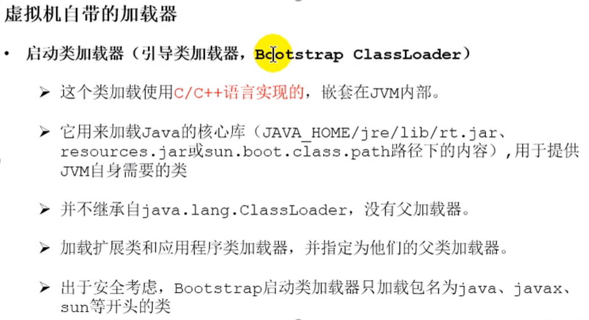

C++ 在底层的实现上面更加的高效些,其实Java可以看成是C++的--版本

Java也是基于C++的


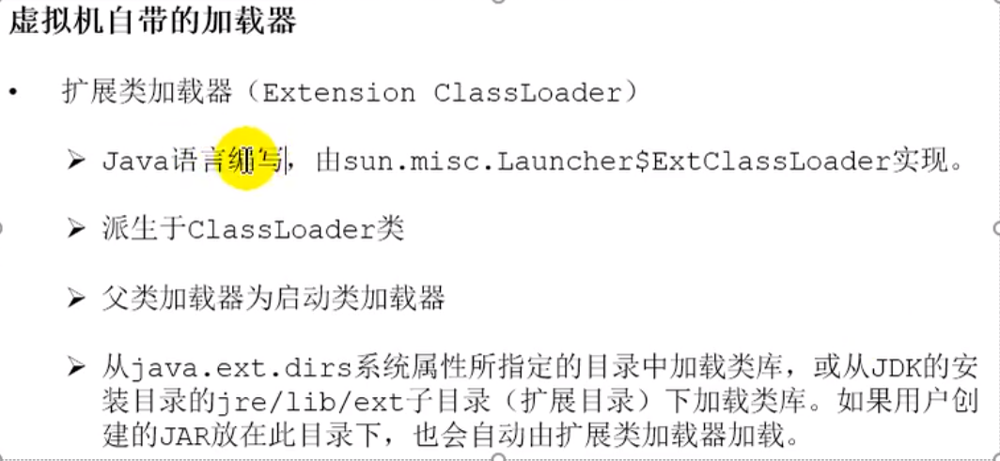


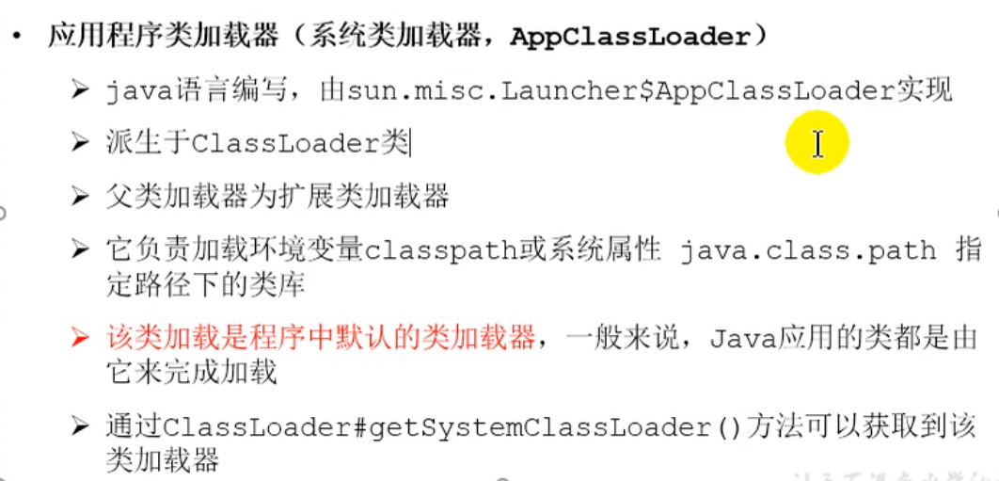


### 用户自定义的类加载器

在Java的日常应用程序开发中,类的加载几乎是由上述3种类加载器相互配合执行的,在必要时,我们还可以自定义类加载器,来定制类的加载方式.

为什么要自定义类加载器
- 隔离加载类
- 修改类加载的方式
- 扩展加载源
- 防止源码泄露

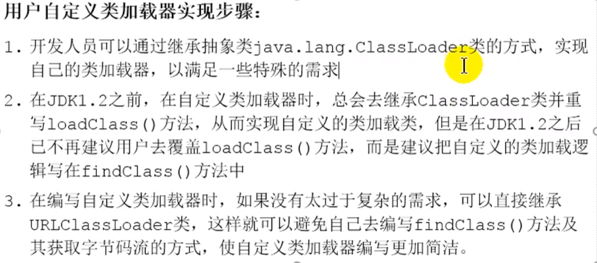

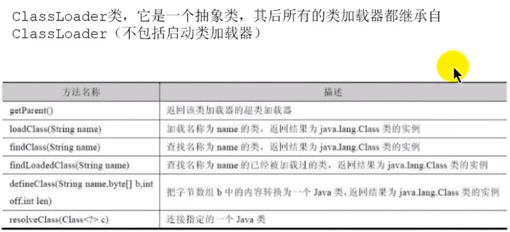


# 获取ClassLoader的途径
```java
package com.atguigu.java;

/**
 * ClassName: CLassLoaderTest2 <br/>
 * Description: CLassLoaderTest2 <br/>
 * Date: 2020-10-22 16:18 <br/>
 * <br/>
 *
 * @author yufengming
 * @version 产品版本信息 2020年10月22日16:18分 yufengming(victorfm@163.com) 新建<br/>
 * <p>
 * 修改记录
 * @email victorfm@163.com
 * @project study_note_01
 * @package com.atguigu.java
 */
public class CLassLoaderTest2 {
    public static void main(String[] args) throws ClassNotFoundException {
        // 1

        ClassLoader cl = Class.forName("java.lang.String").getClassLoader();
        System.out.println(cl);
        //2
        ClassLoader c2 = Thread.currentThread().getContextClassLoader();
        System.out.println(c2);

        //3
        ClassLoader c3 = ClassLoader.getSystemClassLoader().getParent();
        System.out.println(c3);

    }
}

```
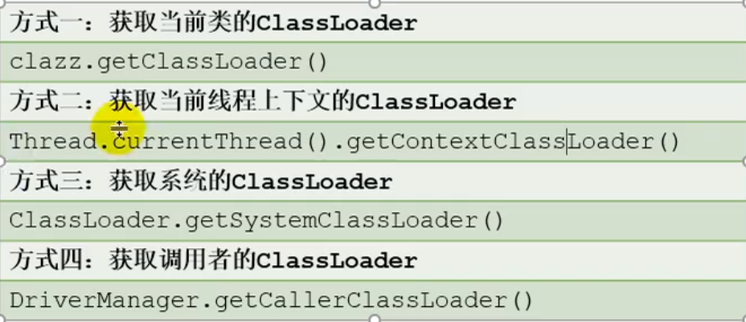

# 双亲委派机制

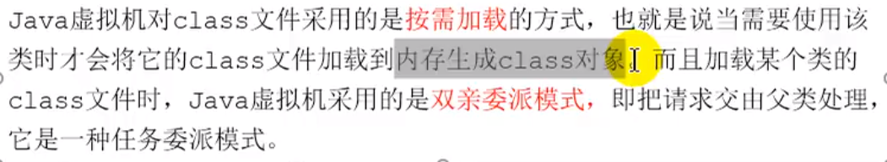

这个双亲委派机制是为了保护恶意定义一些系统的类,防止调用到自定义的

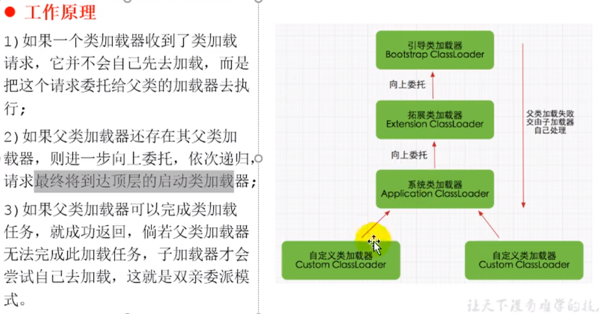

委托父类,一直向上委托,直到父类能够实现加载

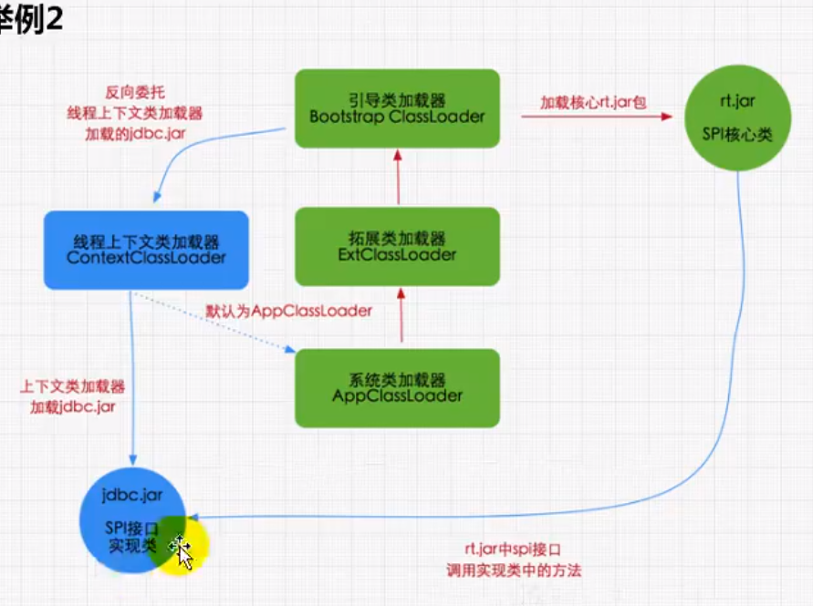

反向委派,

优势: 保护程序的安全

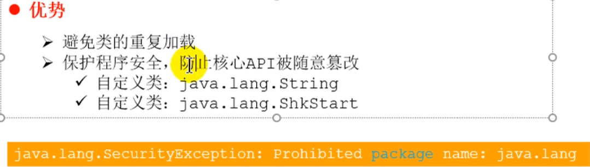

# 沙箱安全机制

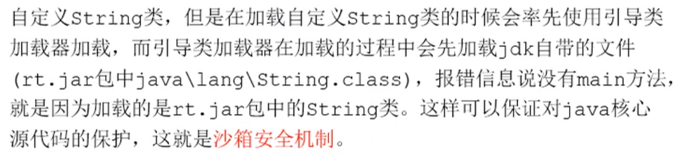

# 其他

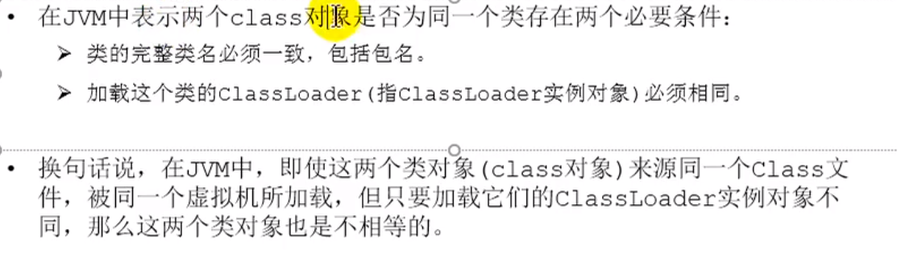

### 类的主动使用和被动使用


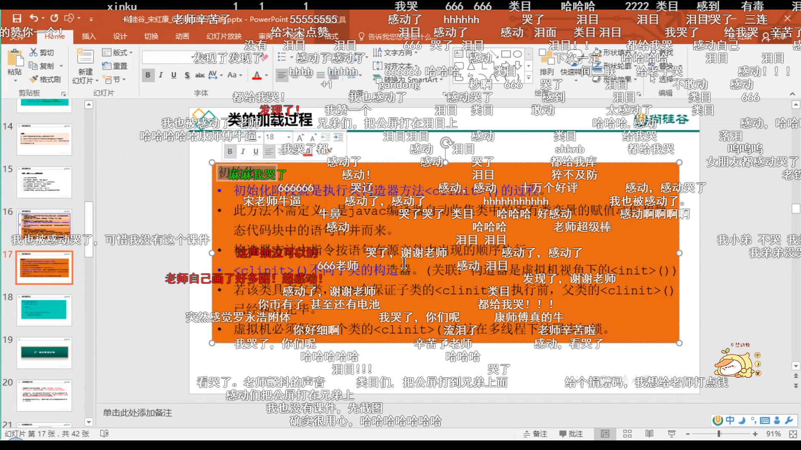


