# 虚拟机栈
目录


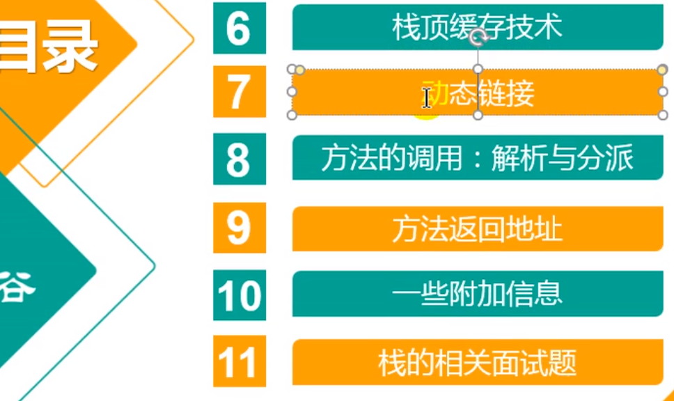

### 虚拟机栈出现的背景

由于跨平台性的设计,Java的指令都是根据栈来设计的. 不同平台CPU架构不同,所以不能设置为基于寄存器的

***优点是跨平台,指令集小,编译器容易实现,缺点是性能下降,实现同样的功能需要更多的指令.***

---
有不少Java开发人员一提到Java内存结构,就会非常粗粒度地将JVM中的内存区理解为仅有Java堆(Heap)和Java栈(stack)? 为什么

### 内存中的栈与堆
**栈是运行时的单位,而堆是存储的单位**
即: 栈解决程序的运行问题,即程序如何执行,或者说如何处理数据.
堆: 堆解决的是数据的存储的问题,即数据怎么放,放在哪儿.

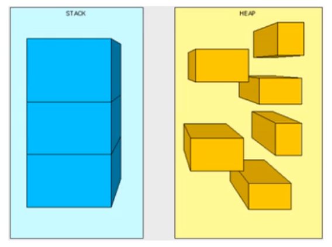

---

比喻

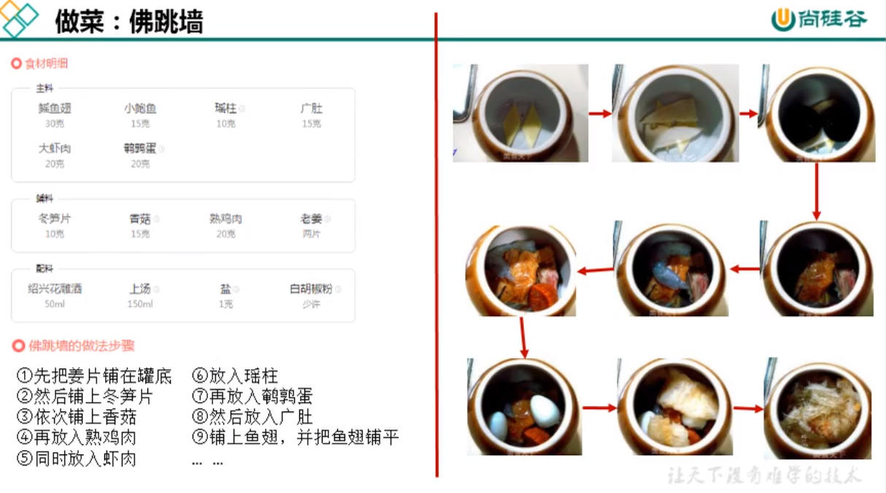

### java 虚拟机栈是什么?

java虚拟机栈(java virtual machine stack)早期,也叫java栈
每个线程在创建是都会创建一个虚拟机栈, 其 内部保存一个个的栈桢(stack Frame)对应着一次次的Java方法调用.

是线程私有的

### 声明周期
    生命周期和线程一致.
### 作用
- 主管java程序的运行,它保存的方法的局部变量(8种基本数据类型,对象的引用地址),部分结果,并参与方法的调用和返回.
- 局部变量 vs 成员变量(或属性)
- 基本数据变量 vs 引用类型变量(类,数组,接口)

### 实例
```java
package com.atguigu.java5;

/**
 * ClassName: StackTest <br/>
 * Description: StackTest <br/>
 * Date: 2020-10-23 10:36 <br/>
 * <br/>
 *
 * @author yufengming
 * @version 产品版本信息 2020年10月23日10:36分 yufengming(victorfm@163.com) 新建<br/>
 * <p>
 * 修改记录
 * @email victorfm@163.com
 * @project study_note_01
 * @package com.atguigu.java5
 */
public class StackTest {
    public static void main(String[] args) {
        StackTest test = new StackTest();
        test.methodA();
    }
    public void methodA(){
        int i = 10;
        int j = 20;
        methodB();
    }
    public void methodB(){
        int k = 30;
        int m = 40;
    }
}

```

**分析一波**

# 栈的特点(优点)

- 栈是一种快速有效的分配存储方式,访问速度仅此云程序计数器.
- JVM 直接对 Java栈的操作只有两个:
  - 每个方法执行,伴随着进栈(入栈,压栈)
  - 执行结束后的出栈工作
- 对于栈来说不存在垃圾回收问题
  - GC ; OOM ;


栈: 先入后出 子弹夹 FILO

队列: 先入先出 FIFO

# 面试题: 开发中遇到的异常有哪些

### 栈可能出现的异常
- java 虚拟机规范允许**java栈的大小是动态的或者是固定不变的**
  - 如果采用固定大小的java虚拟机栈,那每一个线程的Java虚拟机栈容量可以在线程创建的时候独立选定.如果线程请求分配的栈容量超过Java虚拟机栈允许的最大容量,Java虚拟机将会抛出一个**StackOverflowError**异常.
  - 如果Java虚拟机可以动态扩展,并且在尝试扩展的时候无法申请到足够的内存,或者在创建新的线程时没有足够的内存区创建对应的虚拟机栈,那Java虚拟机将会抛出一个**OutOfMemoryError**异常

### 设置内存中的栈的大小
```java
package com.atguigu.java5;

/**
 * ClassName: StackErrorTest <br/>
 * Description: StackErrorTest <br/>
 * Date: 2020-10-23 11:01 <br/>
 * <br/>
 *
 * @author yufengming
 * @version 产品版本信息 2020年10月23日11:01分 
 * yufengming(victorfm@163.com) 新建<br/>
 * <p>
 * 修改记录
 * @email victorfm@163.com
 * @project study_note_01
 * @package com.atguigu.java5
 * 默认情况下: count:11420
 * 设置栈的大小: -Xss 256k:
 */
public class StackErrorTest {
    private static int count = 1;
    public static void main(String[] args) {
        System.out.println(count);
        count++;
        main(args);
    }
}

```

---


```cmd
11410
11411
11412
Exception in thread "main" java.lang.StackOverflowError
	at sun.nio.cs.UTF_8$Encoder.encodeLoop(UTF_8.java:691)
	at java.nio.charset.CharsetEncoder.encode(CharsetEncoder.java:579)
	at sun.nio.cs.StreamEncoder.implWrite(StreamEncoder.java:271)
	at sun.nio.cs.StreamEncoder.write(StreamEncoder.java:125)
	at java.io.OutputStreamWriter.write(OutputStreamWriter.java:207)
	at java.io.BufferedWriter.flushBuffer(BufferedWriter.java:129)
	at java.io.PrintStream.write(PrintStream.java:526)
	at java.io.PrintStream.print(PrintStream.java:597)
	at java.io.PrintStream.println(PrintStream.java:736)
	at com.atguigu.java5.StackErrorTest.main(StackErrorTest.java:20)
```

# 栈的存储单位
### 栈中存储什么?

- 每个线程都有自己的栈,栈中的数据都是以**栈桢(Stack Frame)的格式存在**
- 在这个线程上正在执行的每个方法都各自对应一个栈桢(Stack Frame).
- 栈桢是一个内存区块,是一个数据集,维系着方法执行过程中的各种数据信息.

### 复习

- OOP的基本概念: 类,对象
- 类中基本结构: field(属性,字段,域),method

### 栈运行原理
- JVM 直接对Java栈的操作只有两个,就是对栈桢的**压栈**和**出栈**,**遵循"先进后出"/"后进先出"原则**
- 在一条活动线程中,一个时间点上,只会有一个活动的栈桢.即只有当前正在执行的方法的栈桢(栈顶栈桢)是有效的,这个栈桢被称为**当前栈桢**(current frame),与当前栈桢相对应的方法就是**当前方法**(current method),定义这个方法的类就是**当前类**(current class)
- 执行引擎运行的所有字节码指令只针对当前栈桢进行操作
- 如果在该方法中调用了其他方法,对应的新的栈桢会被创建出来,放在栈的顶端,成为新的当前帧.


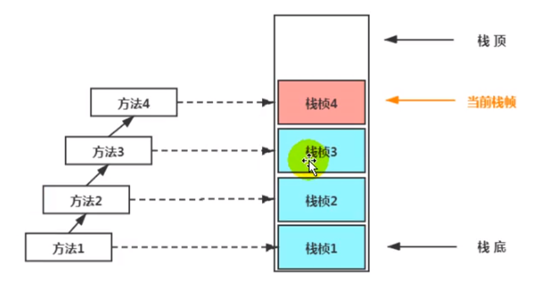

当前栈桢,一直在移动

依次执行


- 不同线程中所包含的栈桢是不允许存在相互引用的,即不可能在一个栈桢之中引用另外一个线程的栈桢.
- 如果当前方法调用了其他方法,方法返回之际,当前栈桢会传回此方法的执行结果给前一个栈桢,接着,虚拟机会丢弃当前栈桢,使得前一个栈桢重新成为当前栈桢.
- Java方法有两种返回函数的方式,一种是正常的函数返回,使用return指令;另外一种是抛出异常.不管使用哪种方式,都会导致栈桢被弹出.

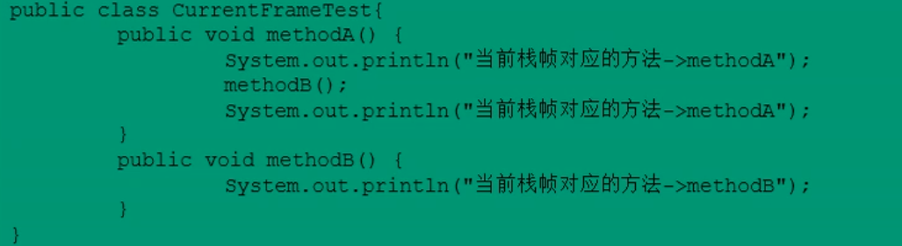

# 栈桢内部结构
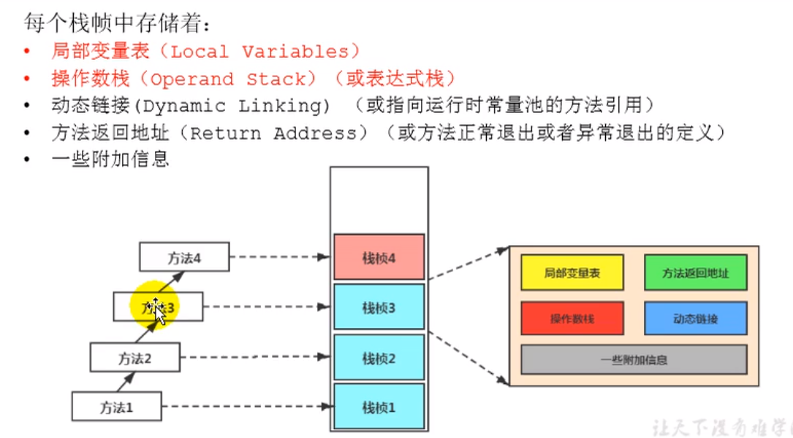

在虚拟机这块儿,有错误的帖子很多,你不能全信

垃圾回收算法

# 局部变量表

- 局部变量表也被称之为局部变量数组或本地变量表
- **定义为一个数字数组,主要用于存储方法参数和定义在方法体内的局部变量,**这些数据类型包括各类基本数据类型,对象引用(reference),以及returnAddress类型.
- 由于局部变量表示建立在线程的栈上,是线程的私有数据,因此**不存在数据安全问题**
- **局部变量表所需的容量大小是在编译期确定下来的**,并保存在方法Code属性的maximum local variables 数据项中.在方法运行期间是不会改变局部变量表的大小的.

javap 命令 解析,这个idea具有反编译功能

>idea中jclasslib 插件

- **方法嵌套调用的次数由栈的大小决定**.一般来说,**栈越大,方法嵌套调用次数越多.**对一个函数而言,它的参数和局部变量越多,使得局部变量表膨胀,它的栈桢就越大,以满足方法调用所需传递的信息增大的需求.进而函数调用就会占用更多的栈空间,导致其嵌套调用次数就会减少.
- **局部变量表中的
- **.在方法执行时,虚拟机通过使用局部变量表完成参数值到参数变量列表的传递过程.**当方法调用结束后,随着方法栈桢的销毁,局部变量表也会随之销毁.

# 关于Slot的理解
- 参数值的存放总是在局部变量数组index0 开始,到数组长度-1 的索引结束.
- 局部变量表,最基本的存储单元是Slot(变量槽)
- 局部变量表中存放编译期可知的各种基本数据类型(8种),引用类型(reference),returnAddress类型的变量.
- 在局部变量表里,32位以内的类型只占用一个slot(包括returnAddress类型),64位的类型(long和double)占用两个slot.
- byte,short,char 在存储前被转换为int,boolean也被转换为int,0 表示 false,非0 表示 true.
- long和double 则占据两个Slot.

- JVM会为局部变量表中的每一个Slot都分配一个访问索引,通过这个索引即可成功访问到局部变量表中指定的局部变量值
- 当一个实例方法被调用的时候,它的方法参数和方法体内部定义的局部变量将会**按照顺序被复制**到局部变量表中的每一个Slot上
- **如果需要访问局部变量表中一个64bit的局部变量值时**,只需要使用前一个**索引**即可.(比如: 访问long或double类型变量)
- 如果当前帧是由构造方法或者实例方法创建的,name**该对象引用this将会存放在index为0的slot处**,其余的参数按照参数表顺序继续排列

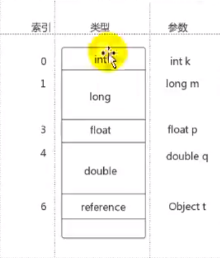

<!--todo https://www.bilibili.com/video/BV1PJ411n7xZ?p=50-->
4分钟

构造器中的this,表示当前创建的变量


---

**栈桢中的布局变量表中的槽位是可以重用的**,如果一个局部变量过了其作用域,那么在其作用域之后申明的新的局部变量就会很有可能会复用过期局部变量的槽位,从而**达到节省资源的目的**


# 变量的分类

### 按照数据类型: 
1. 基本数据类型
2. 引用数据类型

### 按照在类中声明的位置: 
1. 成员变量: 在使用前都经历过初始化赋值
- 使用静态来修饰的(类变量): 
    - linking的prepare阶段:给类变量默认赋值 ---> 
    - initial阶段: 给类变量显示赋值即静态代码
- 实例变量(归具体的对象所有)
    :随着对象的创建,会在堆空间中分配实例变量空间,并进行默认赋值
2. 局部变量: 在使用前,比如要进行显示赋值,否则,编译不通过

```java
public void test5Temp(){
    int num;
    System.out.println(num);
    // 错误信息,变量num没有进行赋值(未初始化错误)
}
```


# 补充说明
- 在栈桢当中,与性能调优关系最为密切的部分就是前面提到的局部变量表.
在方法的执行时,虚拟机使用局部变量表完成方法的传递.
- 局部变量表中的变量也是重要的垃圾回收根节点,只要被局部变量表中直接或间接引用的对象都不会被回收.


在静态的方法当中是不可以引用这个this的

# Slot的重复利用
**栈桢当中的局部变量表中的槽位是可以重用的**,如果一个局部变量过了其作用域,那么在其他作用域之后申明的新的局部变量就很哟与可能会复用过期局部变量的槽位,从而**达到节省资源的目的**


# 52 操作数栈(Operate Stack)
这个是数据结构中的一种,先进后出的特点

栈: 可以通过数组或链表来实现
栈可以看成满足特殊条件的数组或者链表.

---

- 每一个独立的栈桢当中除了包含局部变量表以外,还包含一个后进献出(Last-In-First-Out)的操作数栈,也可以称之为**表达式栈(Expression Stack)**

- **操作数栈,在方法执行过程中,根据字节码指令,往栈中写入数据或提取数据,即入栈(push)/出栈(pop)**.
    - 某些字节码指令将值亚入操作数栈,其余的字节码指令将操作数取出栈.使用它们后再把结果压入栈.
    - 比如:执行复制交换,求和等操作.
    


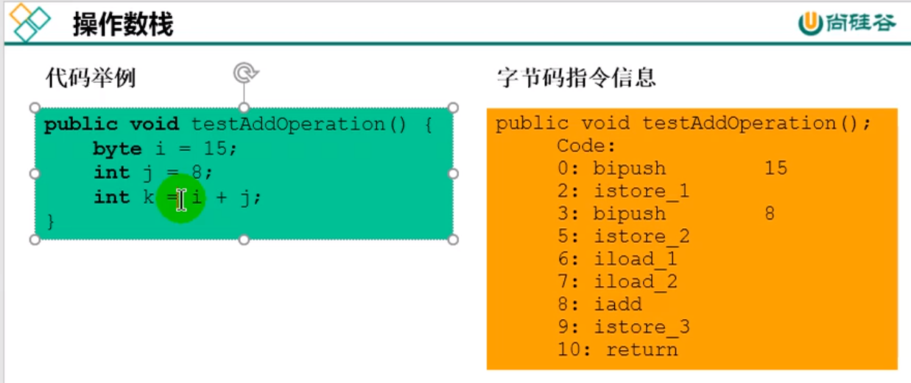


- 操组数栈,**主要用于保存计算过程的中间计算结果,同时作为计算过程中变量临时的存储空间**
- 操作数栈就是JVM执行引擎的一个工作区,当一个方法刚开始执行的时候,一个新的栈桢也会随之被创建出来,**这个方法的操作数栈是空的**
- 每一个操作数栈都会拥有一个明确的栈深度用于存储数值,其所需的最大深度在编译期就定义好了,保存在方法的Code属性中,为Max_stack的值.
- 栈中的任何一个元素都是可以任意Java数据类型
    - 32bit的类型占用一个栈单位深度
    - 64bit的类型占用两个栈单位深度
- 操作数栈**并非采用访问索引的方式来进行数据访问**的,而是只能通过标准的入栈(push)和出栈(pop)操作来完成一次数据访问.


- **如果被调用的方法带有返回值的话,其返回值将会被压入当期栈桢的操作数栈中**,并更新PC寄存器中吓一跳需要执行的字节码指令.
- 操组数栈中元素的数据类型比如与字节码执行的序列严格匹配,这由编译器在编译期间进行验证,同时在类加载过程中的类检验阶段的数据流分析阶段要再次验证.
- 另外,我们说Java虚拟机的**解释引擎是基于栈的执行引擎**,其中的栈值的就是操作数栈.

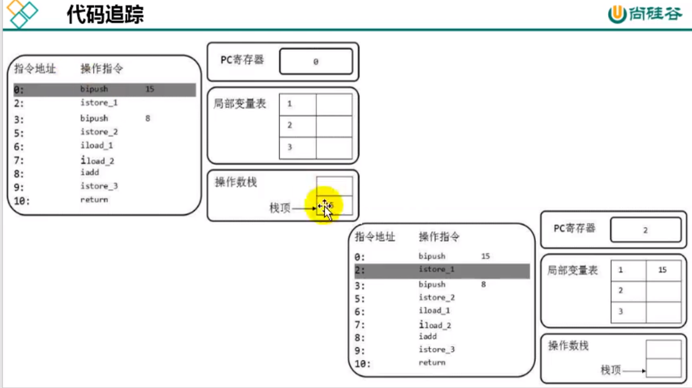

动态链接(或指向运行时常量池的方法引用)

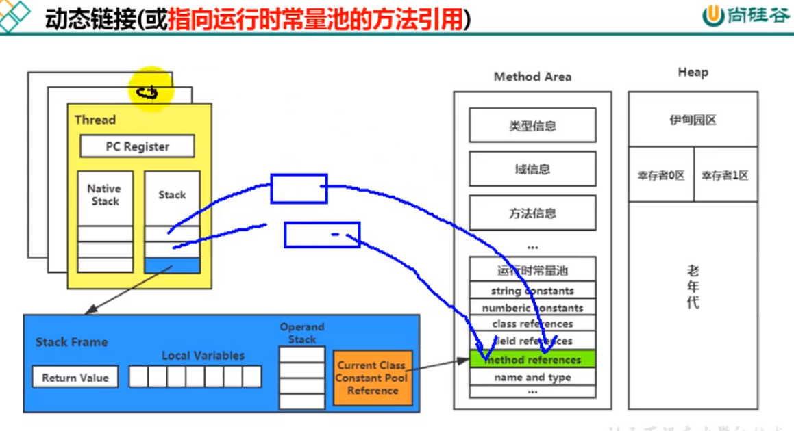


动态链接

---


# 方法的调用
在java虚拟机当中,将符号引用转换为调用方法的直接引用于方法的绑定机制相关

- 静态链接:
当一个字节码文件被装载进JVM内部时,如果被调用的**目标方法在编译期可知**,且运行期保持不变时.这种情况下降调用方法的符号引用转换为直接引用的过程称之为静态链接.
- 动态链接:

如果**如果被调用的方法在编译期无法被确定下来,**也就是说,只能够在程序运行期将调用方法的符号引用转换为直接引用,由于这种引用转换过程具备动态性,因此也就被称之为动态链接.


# 方法的调用
对应的方法的绑定机制为: 早期绑定(Early Binding) 和晚期绑定(Late Binding). **绑定是一个字段,方法或者类在符号引用被替换为直接引用的过程,这仅仅发生一次.
- **早期绑定**:
    早期绑定就是指被调用的**目标方法如果在编译期可知**,**且运行期保持不变**时,即可将这个方法与所属的类型进行绑定,这样一来,由于明确了被调用的目标方法究竟是哪一个,因此也就可以使用静态链接的方式将符号引用转换为直接引用.
- **晚期绑定**:
    如果**被调用的方法在编译期无法被确定下来,只能够在程序运行期根据实际的类型绑定相关的方法**,这种绑定方式也就被称之为**晚期绑定**
随着高级语言的横空出世,类似于Java一样的基于面向对象的编程语言如今越来越多,尽管这类编程语言在语法风格上存在一定的差别,但是它们彼此之间始终保持着一个共性,那就是都支持封装\继承,和多态等面向对象特性,既然**这一类的编程语言具备多态特性,那么自然也就具备早期绑定和晚期绑定两种绑定方式**.

Java 中任何一个普通的方法其实都具备**虚函数**的特征,它们相当于C++语言中的虚函数(C++中则需要使用关键字Virtual来进行显示的定义).如果在Java程序汇总不希望某个方法拥有虚函数的特征时,则可以使用关键字`final`来标记这个方法.


## 虚方法和非虚方法
### 非虚方法
- 如果方法在编译期就确定了具体的调用版本,这个版本在运行时是不可变的.这样的方法称为**非虚方法**
- 静态方法,私有方法,final方法,实例构造器,父类方法都是非虚方法.
- 其他方法称为虚方法.

---

多态的使用前提:
1 类的继承关系
2 方法的重写

## 虚拟机中提供了一些几条方法调用指令:
- 普通调用指令:
  1. invokestatic: 调用静态方法,解析阶段确定唯一方法版本
  2. invokespecial: 调用<init>方法,私有及父类方法,解析阶段确定唯一方法版本
  3. invokevirtual: 调用所有虚方法
  4. invokeinterface: 调用接口方法
- 动态调用指令:
  5. invokedynamic: 动态解析出需要调用的方法,然后执行

前4条指令固化在虚拟机内部,方法的调用执行不可人为干预,而invokedynamic指令则支持由用户确定方法版本.其中**invokestatic**指令和**invokespecial**指令调用的方法称为非虚方法,其余的(final修饰的除外)称为虚方法.


# 练习一下
```java
package com.atguigu.java6;

/**
 * ClassName: Son <br/>
 * Description: Son <br/>
 * Date: 2020-11-04 9:27 <br/>
 * <br/>
 *
 * @author yufengming
 * @version 产品版本信息 2020年11月04日9:27分 yufengming(victorfm@163.com) 新建<br/>
 * <p>
 * 修改记录
 * @email victorfm@163.com
 * @project study_note_01
 * @package com.atguigu.java6
 */


/**\
 *解析
 */
class Father{
    public Father() {
        System.out.println("father的构造器~");
    }

    public static void showStatic(String str) {
        System.out.println("Father"+str);
    }

    public final void showFinal() {
        System.out.println("father show final!");
    }

    public void showCommon() {
        System.out.println("father 普通方法!");
    }

}
public class Son extends Father{
    public Son() {
        super();
    }

    public Son(int age) {
        this();
    }

    /**
     * 不是重写的父类方法
     * @param str
     */
    public static void showStatic(String str) {
        System.out.println(str);
    }

    private void showPrivate(String str) {
        System.out.println("son private"+str);
    }

    public void show() {
        showStatic("autaied.com");
        super.showStatic("ggoaset");
        showPrivate("hellow!");
        super.showCommon();
        showFinal();
        showCommon();
        info();

//        MethodInterface in = null;
//        in.methodA();


    }
    public void info() {

    }

    public static void main(String[] args) {
        new Son().show();
    }
}
```

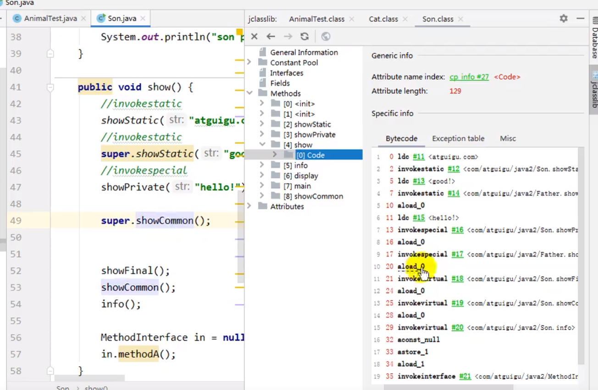

<!--todo https://www.bilibili.com/video/BV1PJ411n7xZ?p=58 -->


### 方法的调用: 关于invokedynamic指令
- JVM字节码指令集一直比较稳定,一直到Java7中才增加了一个invokedynamic指令,这是**Java为了实现[动态类型语言]支持而做的一种改进.**

- 但是在Java7中并没有提供直接生成invokedynamic指令的方法,需要借助ASM这种底层字节码工具来产生invokedynamic指令.**直到Java8的Lambda表达式的出现,inbokedynamic指令的生成,在java中才有了直接的生成方式**


动态类型语言和静态类型语言

动态类型语言和静态类型语言两者的区别就在于对类型的检查是在编译器还是在运行期,满足前者就是静态类型语言,反之是动态类型语言.

说的在直白一点:**静态类型语言是判断变量自身类型信息;动态类型语言是判断变量值的类型信息,变量没有类型信息,变量值才有类型信息**,这是动态语言的一个重要特征.

```
Java: String info = "atguigu"
JS: var name = "victor"; var name = 18
Python: info = 3.5 
```


### 方法的调用: 虚方法与非虚方法

虚拟机中提供了一下几条方法调用指令:
- 普通调用指令:
    **1. invokestatic: 调用静态方法,解析阶段确定唯一方法版本**
    **2. invokespecial: 调用<init>方法,私有及父类方法,解析阶段确定唯一方法版本**
    3. inbokevirtual: 调用所有虚方法
    4. invokeinterface:调用接口方法
    

- 动态调用指令
    5. invokedynamic: 动态解析出需要调用的方法,然后执行

前四条指令固话在虚拟机内部,方法的调用执行不可人为干预,而invokedynamic指令则支持由用户确定方法版本.其中**invokestatic指令和invokespecial指令调用的方法称为非虚方法,其余的(final修饰的除外)称为虚方法.**


### SpringBoot打包 
在pom文件中
```xml
<packaging>war</packaging>
```
打包war ,第二部,移除自带的内置tomcat


### 方法返回地址 return address
当一个方法开始执行后,只有两种方式可以退出这个方法:

1. 执行引擎遇到任意一个方法返回的字节码指令(return),会有返回值传递给上层的方法调用者,简称**正常完成出口**
- 一个方法在正常调用完成之后究竟需要使用哪一个返回指令还需要根据方法为返回值的实际数据类型而定.
- 在字节码指令中,返回指令包含ireturn(当返回值是boolean,byte,char,short和int类型时使用),lreturn,freturn,dreturn以及areturn,另外还有一个return指令供声明为void的方法,实例初始化方法,类和接口的初始化方法使用.

 

在方法执行的过程中遇到了异常(Exception),并且这个异常没有在方法内进行处理,就会导致方法退出,简称: **异常完成出口**

方法执行过程中抛出异常时的异常处理,存储在一个异常处理表,方便在发生异常的时候找到处理异常的代码

存储在一个异常处理表,方便在发生异常时候找出处理异常的代码.

---

本质上,方法的退出就是当前栈桢出栈的过程.此时,需要恢复上层方法的局部变量表,操作数栈,将返回值压入调用者栈桢的操作数栈,设置pc寄存器值等,让调用者方法继续执行下去

**正常完成出口和异常完成出口的区别在于:通过异常完成出口退出的不会给他的上层调用者产生任何的返回值**

### 栈桢中的一些附加信息
栈桢中还允许携带与Java虚拟机实现相关的一些附加信息.例如,对程序调试提供支持的信息.


