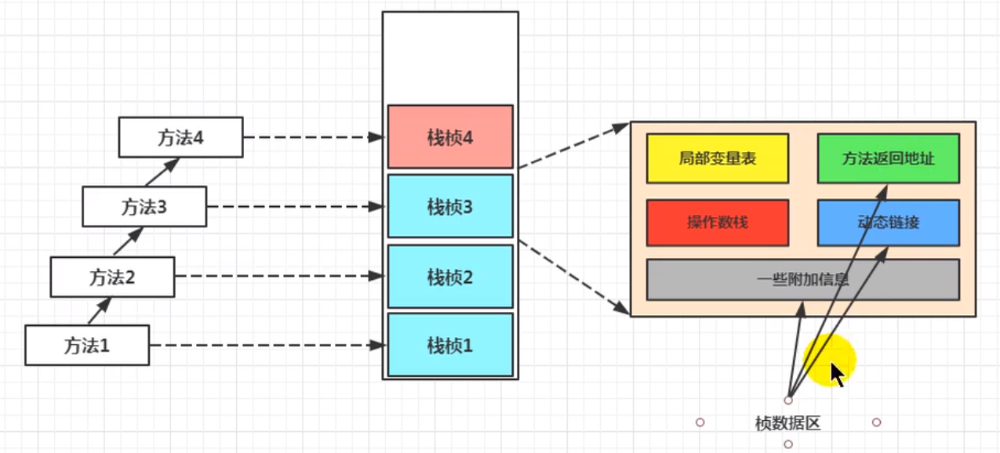

# 虚拟机栈桢几道面试题 

- 举例栈桢出的情况?
    (StackOverflowError)
    - 通过-Xss设置栈的大小;
    - 当我么整个内存空间不足了,我们的栈去扩容的时候出现的这么一个情况OOM
- 调整栈大小,就能保证不出现溢出码?
    - 不能保证
    - 递归情况,内存设置大一点儿就NB了
- 分配的栈内存越大越好吗?
    - 理论上越大,越可能降低StackOverflowError这个概率
- 垃圾回收是否会涉及到虚拟机栈?
- 方法中定义的局部变量是否线程安全?

面试题:
方法中局部变量是否有线程安全?具体情况具体分析,

马克思主义: 

何为线程安全?
    如果只有一个线程才可以操作此数据,则必是线程安全的.
    如果有多个线程操作此数据,则此数据是共享数据.如果不考虑同步机制的话,会存在线程安全问题.
     
sbuilder的操作过程，是线程不安全的

    
### 什么是本地方法
简单滴将:一个Native Method就是一个Java调用非java代码的接口.

一个Native Method 是这样一个Java方法:该方法的实现由非Java语言实现,比如C.这个特征并非Java所特有,很多其他的编程语言都有这一机制,比如在C++中,你可以用extern "c"告知 C++ 编译器去调用有一个C的函数.

"A native method is a Java method whose implementation is provided by non-java code." 

在定义一个native method 时,并不提供实现体(有些像定义一个Java interface),因为其实现体是由非java语言在外面实现的.

本地接口的作用是融合不同语言为Java所用,它的初衷是融合C/C++程序.

### 为什么要使用Native Method
Java使用起来非常方便,然而有些层次的任务用Java实现起来不容易,或者我们对程序的效率很在意时,问题就来了.
1000转
  
低扭强

换挡慢

### 与操作系统交互

JVM支持着Java语言本身和运行时库,它是Java程序赖以生存的平台,它由一个解释器(解释字节码)和一些连接到本地代码库组成.然而不管怎么样,它毕竟不是一个完整的系统,它经常依赖于一些底层系统的支持.这些底层系统常常是强大的操作系统.
**通过使用本地方法,我们得以用Java实现了jre与底层系统的交互,甚至JVM的一些部分就是用C写的**还有,如果我们要使用一些Java语言本身没有提供封装的操作系统的特性时,我们也需要使用本地方法.

### Sun's Java
**Sun的解释器是用C实现的,这使得它能像一些普通的C一样与外部交互.**
jre大部分是Java实现的,它也通过一些本地方法与外界交互.例如: 类Java.lang.Thread 的 setPriority()方法是用Java实现的,但是它实现调用的是该类里的本地方法setPriority0().这个本地方法是用C实现的,并被植入JVM内部,在Window95的平台上,这个本地方法最终将调用Win32 SetPriority() API.这是一个本地方法的具体实现由JVM直接提供,更多的情况是本地方法由外部的动态链接库(external dynamic link library)提供,然后被JVM调用.

继续jvm

continue~

